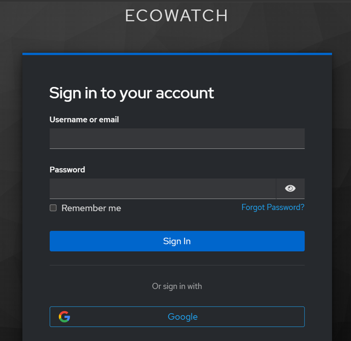
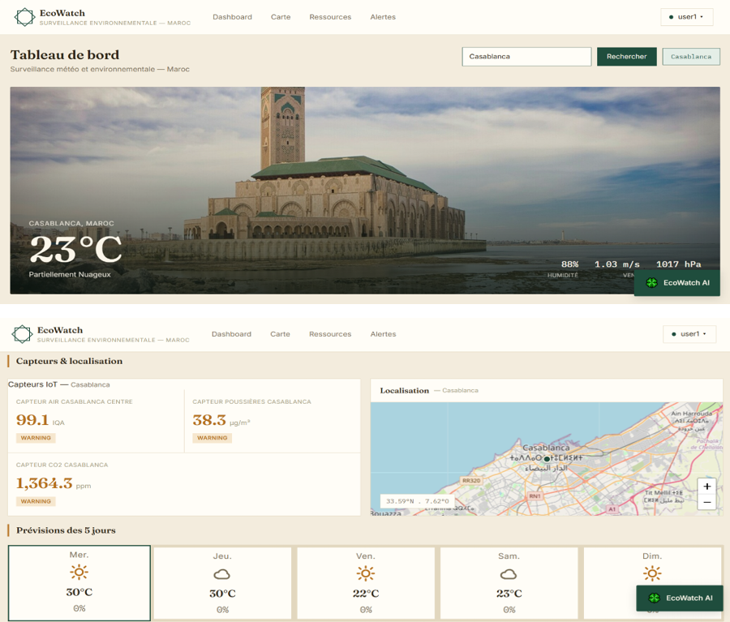
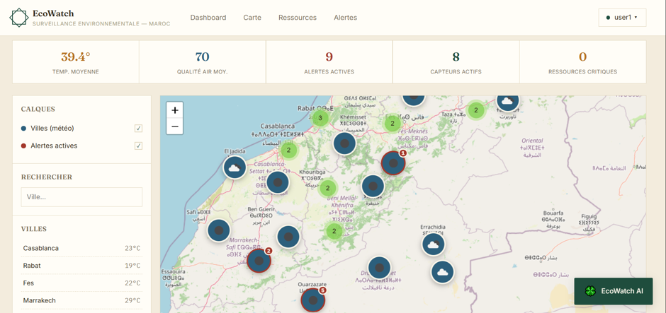
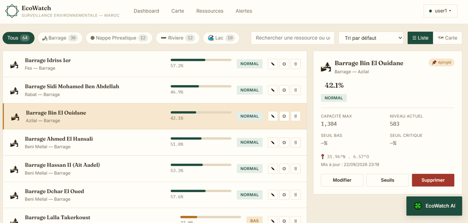
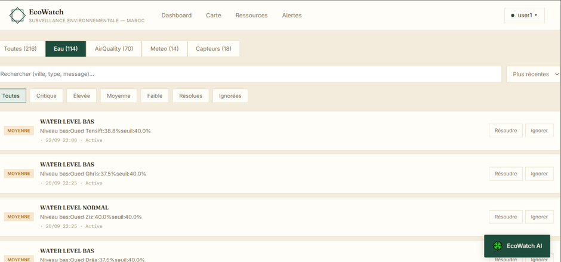
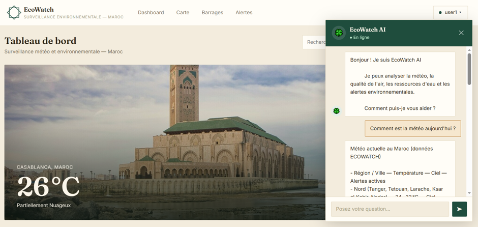

# 🌍 EcoWatch — Plateforme Intelligente de Surveillance Météorologique et Environnementale

**EcoWatch** est une plateforme intelligente de surveillance météorologique et environnementale développée dans le cadre d'un **Projet de Fin d'Études (PFE)**.

L'objectif du projet est de centraliser et exploiter des données météorologiques et environnementales afin de permettre leur **consultation, leur surveillance et la détection automatique de situations nécessitant une attention particulière**.

La plateforme repose sur une **architecture microservices**, une authentification sécurisée avec **Keycloak**, une interface web développée avec **Angular** et un **assistant conversationnel basé sur l'IA générative**.

---

## 📌 Fonctionnalités principales

### 🌦️ Surveillance météorologique

* Récupération des données météorologiques depuis **OpenWeatherMap**.
* Surveillance de plusieurs villes marocaines.
* Affichage de :
    * Température
    * Humidité
    * Vitesse du vent
    * Description météorologique
* Mise à jour périodique des données.
* Récupération et stockage des prévisions météorologiques.

### 💧 Surveillance des ressources en eau

* Gestion des ressources en eau.
* Suivi de leur niveau actuel.
* Définition de seuils de surveillance.
* Détection des situations nécessitant une intervention.

### 📡 Simulation IoT

Le projet intègre un service IoT permettant de simuler le fonctionnement de capteurs environnementaux.

Les mesures sont générées périodiquement par des tâches planifiées et peuvent être utilisées pour :

* Simuler des relevés de capteurs.
* Stocker les mesures.
* Surveiller l'état des ressources.
* Détecter automatiquement certaines situations anormales.

> Les capteurs utilisés dans ce projet sont simulés logiciellement. Aucun matériel IoT physique n'est nécessaire pour exécuter la plateforme.

### 🚨 Gestion des alertes

Le système permet de détecter et gérer des alertes environnementales. 

Les alertes peuvent être associées à différents niveaux de gravité et leur traitement peut être 
effectué par un utilisateur disposant des droits d'administration.

### 🤖 Assistant intelligent

EcoWatch intègre un assistant conversationnel basé sur **Spring AI** et un modèle fourni par **Groq**.

L'assistant peut interagir avec les données de la plateforme grâce à des outils permettant notamment de consulter :

* Les données météorologiques.
* Les alertes.
* Les ressources en eau.
* Les données environnementales disponibles via les services concernés.

L'objectif est de permettre à l'utilisateur d'interroger la plateforme en langage naturel.

### 🔐 Sécurité

La sécurité est assurée par **Keycloak** et **Spring Security**.

Le système utilise :

* OAuth 2.0
* OpenID Connect
* JWT
* Authorization Code Flow
* PKCE avec S256
* Gestion des rôles

Deux rôles principaux sont utilisés :

* `USER`
* `ADMIN`

Les droits d'accès aux différentes fonctionnalités sont contrôlés en fonction du rôle de l'utilisateur.

---

# 🏗️ Architecture

EcoWatch est basé sur une architecture distribuée composée de plusieurs microservices.

```text
                         ┌──────────────────────┐
                         │      Angular         │
                         │      Frontend        │
                         └──────────┬───────────┘
                                    │
                                    ▼
                         ┌──────────────────────┐
                         │      Keycloak        │
                         │ OAuth2 / OIDC / JWT  │
                         └──────────┬───────────┘
                                    │
                                    ▼
                         ┌──────────────────────┐
                         │     API Gateway      │
                         └──────────┬───────────┘
                                    │
              ┌─────────────────────┼─────────────────────┐
              │                     │                     │
              ▼                     ▼                     ▼
     ┌────────────────┐   ┌────────────────┐   ┌────────────────────┐
     │ Weather Service│   │   IoT Service  │   │  AI Agent Service  │ 
     └───────┬────────┘   └───────┬────────┘   └─────────┬──────────┘
             │                    │                      │
             ▼                    ▼                      ▼
     ┌───────────────┐    ┌───────────────┐       ┌──────────────┐
     │  PostgreSQL   │    │  PostgreSQL   │       │    Groq      │
     └───────────────┘    └───────────────┘       └──────────────┘
                                  ▲
                                  │
                         ┌────────┴────────┐
                         │ Data Aggregation│
                         │      BFF        │
                         └─────────────────┘

              ┌─────────────────────────────────────────────┐
              │            Infrastructure                   │
              │                                             │
              │ Discovery Service │ Config Service │ Docker │
              └─────────────────────────────────────────────┘
```

### 🧩 Microservices

| Service                      | Responsabilité                                          |
|------------------------------| ------------------------------------------------------- |
| **API Gateway**              | Point d'entrée de l'application et routage des requêtes |
| **Weather Service**          | Données météorologiques et prévisions                   |
| **IoT Service**              | Capteurs simulés, mesures, ressources en eau et alertes |
| **Data Aggregation Service** | Agrégation des données Weather et IoT                   |
| **AI Agent Service**         | Assistant conversationnel basé sur l'IA                 |
| **Config Service**           | Centralisation de la configuration                      |
| **Discovery Service**        | Découverte des services                                 |
| **Keycloak**                 | Authentification et autorisation                        |

Le **Data Aggregation Service** fonctionne comme un **Backend for Frontend (BFF)**. Il ne possède pas sa propre base de données et récupère les informations nécessaires auprès des services Weather et IoT.

---

# 🗄️ Gestion des données

Le projet suit une approche **Database per Service** pour les microservices qui possèdent des données persistantes.

```text
Weather Service
       │
       ▼
ecowatch_weather_db


IoT Service
       │
       ▼
ecowatch_iot_db
```

Les bases de données sont développées avec **PostgreSQL** et exploitées avec :

* Spring Data JPA
* Hibernate
* PostgreSQL

---

# 🛠️ Technologies utilisées

## Backend

* Java 21
* Spring Boot
* Spring Cloud
* Spring Security
* Spring Data JPA
* Hibernate
* OpenFeign
* Spring AI
* Maven

## Architecture distribuée

* Spring Cloud Gateway
* Eureka Server
* Spring Cloud Config Server
* Microservices
* Backend for Frontend (BFF)

## Frontend

* Angular
* TypeScript
* Bootstrap
* Leaflet

## Sécurité

* Keycloak
* OAuth 2.0
* OpenID Connect
* JWT
* PKCE

## Intelligence artificielle

* Spring AI
* Groq
* LLM avec appels d'outils

## Données et APIs

* PostgreSQL
* OpenWeatherMap API
* REST API

## Dev / Infrastructure

* Docker
* Git
* GitHub
* IntelliJ IDEA
* Postman
* OpenAPI / Swagger
* Spring Boot Actuator

---

# 🚀 Installation et exécution

## 1. Prérequis

Avant de lancer le projet, installer :

* Java 21
* Maven
* Node.js et npm
* Angular CLI
* Docker
* PostgreSQL ou Docker Desktop
* Keycloak

---

## 2. Cloner le projet

```bash
git clone -b dev https://github.com/MOKDAD2107/PFE--Soutenance-.git
cd PFE--Soutenance-
```

---

# 🔐 Configuration des variables d'environnement

Les clés API et informations sensibles ne sont pas stockées dans Git.

Créer un fichier `.env`

Exemple :

```env
OPENWEATHER_API_KEY=your_openweathermap_api_key
GROQ_API_KEY=your_groq_api_key
POSTGRES_USERNAME=postgres
POSTGRES_PASSWORD=your_postgresql_password
```
> Spring Boot ne lit pas automatiquement le fichier .env. Dans IntelliJ:
>
> ouvrir Run > Edit Configurations, choisir le service, puis Modify options > Environment variables et y recopier les variables (séparées par ;). Variables nécessaires : OPENWEATHER_API_KEY (weather-service), GROQ_API_KEY (ai-agent-service) et le mot de passe PostgreSQL.

# 🌦️ Configuration OpenWeatherMap

Le Weather Service utilise l'API OpenWeatherMap.

Créer un compte sur OpenWeatherMap et récupérer une clé API.

La clé est ensuite fournie à l'application via :

```env
OPENWEATHER_API_KEY=your_api_key
```

La configuration Spring utilise :

```properties
openweathermap.api.key=${OPENWEATHER_API_KEY}
```

---

# 🤖 Configuration Groq

L'AI Agent Service utilise Groq pour accéder au modèle de langage.

Créer une clé API Groq puis définir :

```env
GROQ_API_KEY=your_groq_api_key
```

La configuration Spring utilise :

```properties
spring.ai.openai.api-key=${GROQ_API_KEY}
```

Le service utilise l'API compatible OpenAI de Groq.

---

# 🔑 Configuration Keycloak

Créer un realm Keycloak :

```text
ecowatch
```

Configurer le client utilisé par l'application Angular ainsi que les rôles :

```text
USER
ADMIN
```

Le backend utilise le realm :

```text
http://localhost:8080/realms/ecowatch
```

Les services sécurisés utilisent JWT pour vérifier l'identité et les autorisations des utilisateurs.

---

# ▶️ Démarrage du projet

L'ordre recommandé de démarrage est :

```text
1. PostgreSQL
2. Keycloak
3. Eureka Server
4. Config Server
5. Microservices
6. API Gateway
7. Angular Frontend
```

L'AI Agent Service peut ensuite communiquer avec Groq et les services internes via les APIs disponibles.

---

# 🧪 Tests

Les APIs peuvent être testées avec :

* Postman
* IntelliJ HTTP Client
* Swagger / OpenAPI

Les fonctionnalités principales testées comprennent :

* Authentification
* Autorisation par rôle
* Récupération des données météorologiques
* Prévisions météorologiques
* Gestion des capteurs
* Gestion des ressources en eau
* Génération et gestion des alertes
* Agrégation des données
* Interaction avec l'assistant IA

---

# 📊 Fonctionnement des tâches planifiées

Plusieurs tâches planifiées permettent d'actualiser automatiquement les données.

### Weather Service

```text
WeatherScheduler
        │
        └── Mise à jour périodique de la météo

WeatherPrevisionScheduler
        │
        └── Mise à jour périodique des prévisions
```

### IoT Service

```text
IotSensorScheduler
        │
        └── Simulation des mesures des capteurs

WaterRessourceScheduler
        │
        └── Surveillance des ressources en eau

AlertScheduler
        │
        └── Détection / traitement des alertes
```

---

# 🤖 Fonctionnement de l'assistant IA

Le fonctionnement général est le suivant :

```text
Utilisateur
     │
     ▼
Angular
     │
     ▼
AI Agent Service
     │
     ▼
Groq / LLM
     │
     ├── Weather Tool ──────► Weather Service
     │
     ├── Alert Tool ────────► IoT Service
     │
     └── Water Tool ────────► IoT Service
     │
     ▼
Réponse générée
     │
     ▼
Utilisateur
```

L'assistant ne repose pas sur une base documentaire RAG dans cette version. Il interroge directement les données disponibles dans la plateforme via des outils.

---
# 📰 Les interfaces de la plateforme

### 🔐 Interface d'authentification avec Keycloak : 



### 📊 Tableau de bord de la plateforme : 



### 🗺️ Vue cartographique des données environnementales :


### 💧 Interface de suivi des ressources en eau pour un utilisateur ADMIN :



### 🚨 Interface de consultation des alertes environnementales pour un utilisateur ADMIN :



### 🤖 Interface de l'assistant conversationnel




---

# 📁 Structure du projet

Une organisation possible du repository est :

```text
EcoWatch/
│
├── config-repo/
│   ├── application.properties
│   ├── WEATHER-SERVICE.properties
│   ├── IOT-SERVICE.properties
│   ├── DATA-AGGREGATION-SERVICE.properties
│   └── AI-AGENT-SERVICE.properties
│
├── config-service/
│
├── discovery-service/
│
├── gateway-service/
│
├── weather-service/
│
├── iot-service/
│
├── data-aggregation-service/
│
├── ai-agent-service/
│
├── ecowatch-frontend/
│
├── .env
├── .gitignore
└── README.md
```

---

# 👨‍💻 Auteur

**Mohamed Mokdad**

Projet de Fin d'Études — Master Ingénierie Informatique
**Big Data & Cloud Computing (II-BDCC)**
ENSET Mohammedia
Année universitaire **2025–2026**

---

